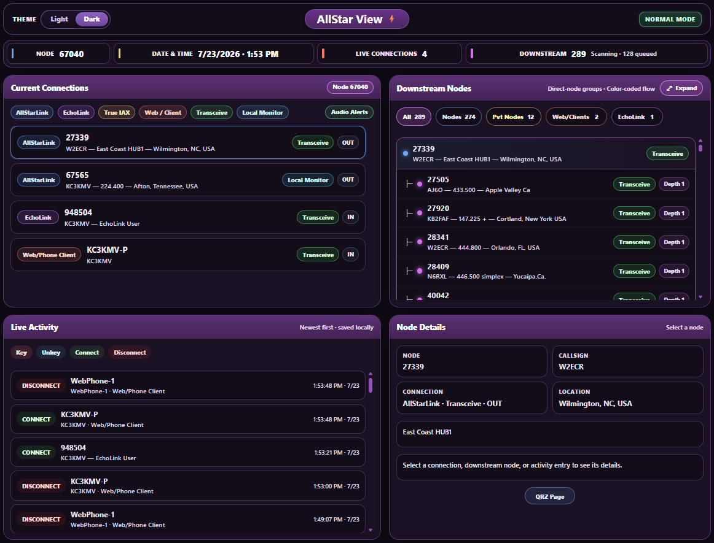
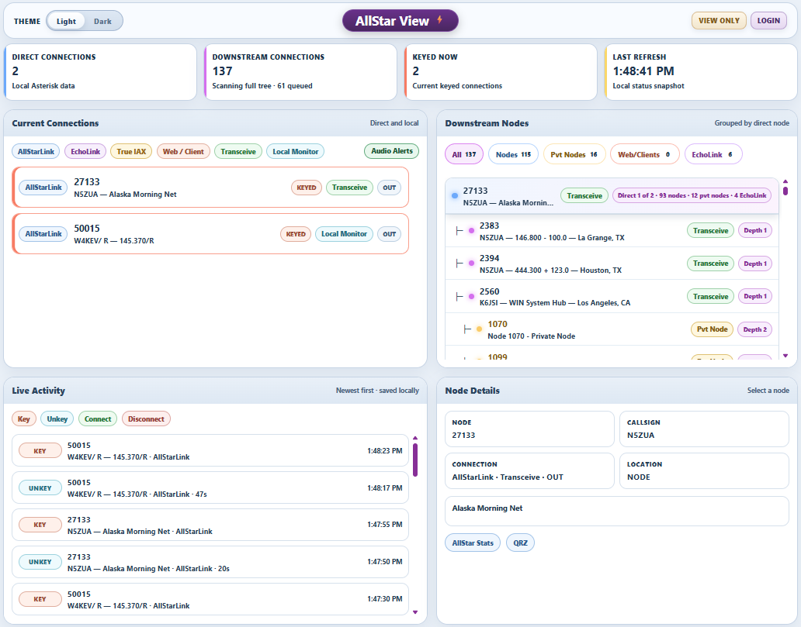

# AllStar View

## Standalone AllStarLink Monitoring

AllStar View is a standalone, read-only web monitor for AllStarLink 3 / `app_rpt` systems.

It provides a clear view of current connections, live activity, and downstream node paths without connecting or disconnecting nodes, changing link modes, restarting Asterisk, or altering node operation.

AllStar View is designed for desktop and cellphone use, with light and dark themes.

---

<p align="center">
  <a href="screenshot.png">
    
  </a>
</p>

<p align="center">
  <em>AllStar View dark mode with direct connections, grouped downstream paths, live activity, and node details.</em>
</p>

<p align="center">
  <a href="screenshot-light.png">
    
  </a>
</p>

<p align="center">
  <em>AllStar View light mode with the Light/Dark switch and the same responsive monitoring layout.</em>
</p>

---

## What It Shows

AllStar View can display:

- current AllStarLink connections
- current EchoLink connections
- Web/Phone clients
- live Connect, Key, Unkey, and Disconnect activity
- grouped downstream trees for each directly connected node
- private nodes beneath the connection path they belong to
- full clickable connection paths
- node and callsign details
- QRZ links for recognized amateur callsigns
- AllStar Stats links for valid AllStarLink nodes
- optional spoken connection alerts

When several direct nodes are connected, each downstream tree remains grouped beneath its own direct connection so it is clear which nodes belong to which path.

---

## Downstream Filters

The Downstream Nodes panel includes filters for:

- **All**
- **Nodes**
- **Pvt Nodes**
- **Web/Clients**
- **EchoLink**

Each filter shows the matching live count.

Clicking a direct connection brings that connection’s downstream group into view. Clicking a downstream row opens its available details.

---

## Faster Updates Between Local Nodes

When directly connected nodes both run AllStar View and can reach each other, each node can use the other node’s read-only local status for faster Web/Phone, EchoLink, and direct-node updates.

If the peer status is not available, AllStar View continues with normal AllStar Stats scanning.

---

## EchoLink Identification

AllStar View uses live connection information and EchoLink lookups to show the callsign and assigned EchoLink node number.

When a directly connected peer also runs AllStar View, its live local status is used instead of temporary relay data when available.

---

## Read-Only by Design

AllStar View does not:

- connect or disconnect nodes
- restart Asterisk
- change link modes
- modify AllStarLink or EchoLink configuration
- alter node operation

It uses a narrowly restricted helper to read only the Asterisk status information needed for monitoring.

---

## Requirements

You should already have:

- a working AllStarLink 3 / `app_rpt` node
- Apache
- PHP
- Asterisk installed at `/usr/sbin/asterisk`
- internet access for AllStar Stats and EchoLink identity lookups

AllStar View does not configure or repair an AllStarLink installation.

---

## First-Time Install

```bash
cd /var/www/html
sudo git clone https://github.com/TerryClaiborne/allstar_view.git allstar_view
cd allstar_view
sudo ./setup_allstar_view.sh
```

The installer creates `config.ini` from `config.ini.example` only when `config.ini` does not already exist.

When AllTune2 is already installed, first-time setup can copy only `MYNODE`, `DVSWITCH_NODE`, and `HIDE_NODES` from the existing AllTune2 configuration as a one-time convenience. AllStar View does not depend on AllTune2 after installation.

Review the configuration before using the application:

```bash
sudo nano /var/www/html/allstar_view/config.ini
```

Then open:

```text
http://YOUR-NODE-IP-ADDRESS/allstar_view/public/
```

Example:

```text
http://192.168.1.120/allstar_view/public/
```

Replace `192.168.1.120` with the IP address or hostname of your node.

---

## Configuration

The live configuration file is:

```text
/var/www/html/allstar_view/config.ini
```

Starter layout:

```ini
MYNODE="YOUR NODE"
DVSWITCH_NODE=""
HIDE_NODES=""
ALLSTAR_VIEW_AUTH_ENABLED=0
ALLSTAR_VIEW_ADMIN_USER="admin"
ALLSTAR_VIEW_ADMIN_PASSWORD_HASH=""
```

### Required setting

`MYNODE` is the local AllStarLink node number being monitored.

Example:

```ini
MYNODE="67040"
```

### Optional node-display settings

`DVSWITCH_NODE` is the local private DVSwitch node, when one is used. Setting it keeps that local private node from appearing as a normal direct connection or as part of the downstream topology.

Example:

```ini
DVSWITCH_NODE="1957"
```

Leave it empty when there is no private DVSwitch node:

```ini
DVSWITCH_NODE=""
```

`HIDE_NODES` is an optional comma- or space-separated list of additional node numbers to suppress from the downstream display.

Examples:

```ini
HIDE_NODES=""
HIDE_NODES="1234,5678"
```

### Authentication settings

Authentication is optional and disabled by default.

The setup script manages these values:

```ini
ALLSTAR_VIEW_AUTH_ENABLED=0
ALLSTAR_VIEW_ADMIN_USER="admin"
ALLSTAR_VIEW_ADMIN_PASSWORD_HASH=""
```

Do not place a plain-text password in `config.ini`, and do not manually edit the saved password hash.

When authentication is disabled, the header shows **Normal Mode**. When enabled and signed out, it shows **View Only** and **Login**. After login, it shows **Signed In** and **Logout**.

---

## Optional Web Login

Set or replace the administrator password and enable login:

```bash
sudo /var/www/html/allstar_view/setup_allstar_view.sh --set-admin-password
```

The password is requested twice. If the two entries do not match, the command exits without changing `config.ini`.

Disable login while preserving the saved password hash:

```bash
sudo /var/www/html/allstar_view/setup_allstar_view.sh --disable-auth
```

Re-enable login later with the preserved password hash:

```bash
sudo /var/www/html/allstar_view/setup_allstar_view.sh --enable-auth
```

The login username is:

```text
admin
```

Run normal setup before using the authentication commands on a new installation.

---

## Update

```bash
cd /var/www/html/allstar_view
sudo git pull origin main
sudo ./setup_allstar_view.sh
```

Normal setup and updates preserve:

- `config.ini`
- the saved authentication password hash
- activity history
- current snapshots
- downstream scan state
- AllStar Stats cache
- EchoLink cache

The setup script may be run again safely to refresh permissions, Apache protection, and the restricted read-only helper.

---

## Runtime Data

AllStar View keeps bounded local runtime data for:

- current snapshots
- downstream scan progress
- activity history
- AllStar Stats lookups
- EchoLink identity lookups

Writable data stays under:

```text
/var/www/html/allstar_view/run/
/var/www/html/allstar_view/logs/
/var/www/html/allstar_view/cache/
```

History and caches are automatically limited so they do not grow without bounds.

---

## Light and Dark Themes

Use the **Light / Dark** switch in the header to change themes.

The selected theme is stored in the browser. Theme selection does not change node configuration or server files.

---

## Audio Alerts

The **Audio Alerts** button enables or disables browser speech announcements for connection changes.

Audio alerts are optional and depend on browser speech support. Some browsers require user interaction with the page before spoken announcements are allowed.

---

## Security

The installer provides:

- Apache protection for private source, runtime, log, and cache directories
- a narrowly restricted read-only Asterisk helper
- source files that are not writable by the web server
- writable access limited to AllStar View’s own bounded runtime directories
- optional password-protected web login
- preservation of existing configuration during updates

AllStar View does not require broad Asterisk control permissions.

For access from outside the local network, prefer Tailscale, a VPN, or trusted HTTPS.

---

## Troubleshooting

### Downstream results appear gradually

A large downstream tree builds in stages. The last completed tree stays visible while a new scan runs, and one failed lookup does not stop the rest of the queue.

### Audio alerts do not speak

Use the **Audio Alerts** control and interact with the page once. Browser autoplay rules can prevent speech until the page receives user input.

### Login is not shown

Authentication is disabled by default. Enable it with:

```bash
sudo /var/www/html/allstar_view/setup_allstar_view.sh --set-admin-password
```

### Existing password should be re-enabled

When the password was previously set and later disabled, use:

```bash
sudo /var/www/html/allstar_view/setup_allstar_view.sh --enable-auth
```

### No status appears

Confirm that:

- `MYNODE` contains the correct local node number
- Asterisk is running
- the read-only helper is executable
- Apache and PHP can run the application
- the installer completed without errors

---

## Project Scope

AllStar View is intentionally focused:

**Monitor the node clearly, preserve runtime data, and avoid changing node operation.**

---

## Contact

Questions or reports:

[kc3kmv@yahoo.com](mailto:kc3kmv@yahoo.com)
